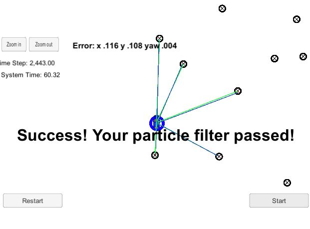

# Kidnapped Vehicle Project 
Self-Driving Car Engineer Nanodegree Program Term2 project3

My code built without error with cmake .. && make, and connected to GUI with ./run.sh. It runs with success. 

The car has been kidnapped on the map with (noisy) GPS estimate as its initial location, and lots of (noisy) sensor observations and control data. The key steps include initializing paricles with GPS data, predicting with velocity and yaw rate and update particles weight and resampling. 

The steps of weight updates for each particle start with observation points transformation to map coordinates, then finding the nearest landmark for each observation point, and finally multiplied the weight by the multivariaent Gaussian probability measuring the distance between the observation points to its associated landmark. 